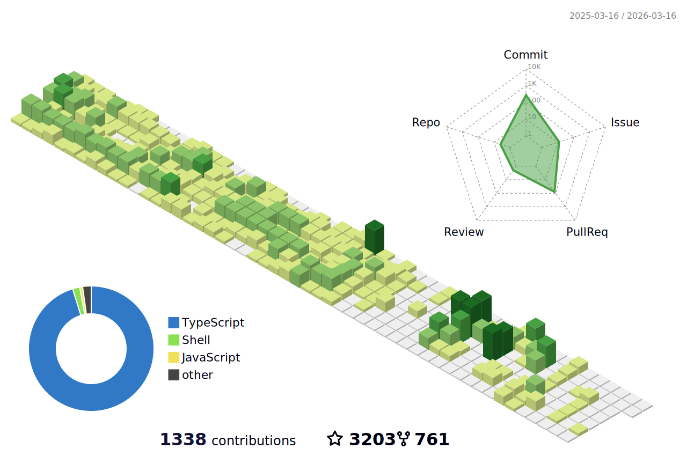

<h1 align="center">Hi 👋, I'm log1997</h1>

  
   
  
  <picture>
    <source
        media="(prefers-color-scheme: dark)"
        srcset="https://github.com/log1997/log1997/blob/output/github-contribution-grid-snake-dark.svg"
    />
    <source
        media="(prefers-color-scheme: light)"
        srcset="https://github.com/log1997/log1997/blob/output/github-contribution-grid-snake.svg"
    />
  </picture> 

    

    <h2>💖Stats💖</h2>
    
     
    
    
    
    
    
    

    <h2>🏆Github Profile Trophy</h2>
    

